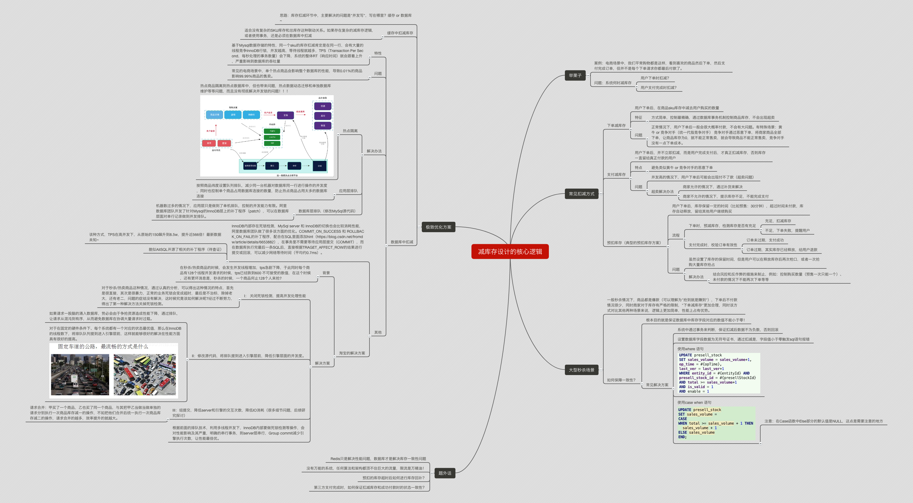
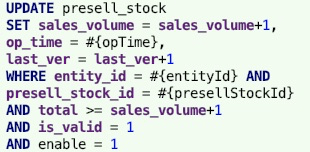
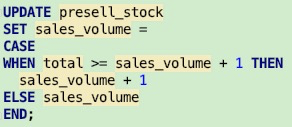
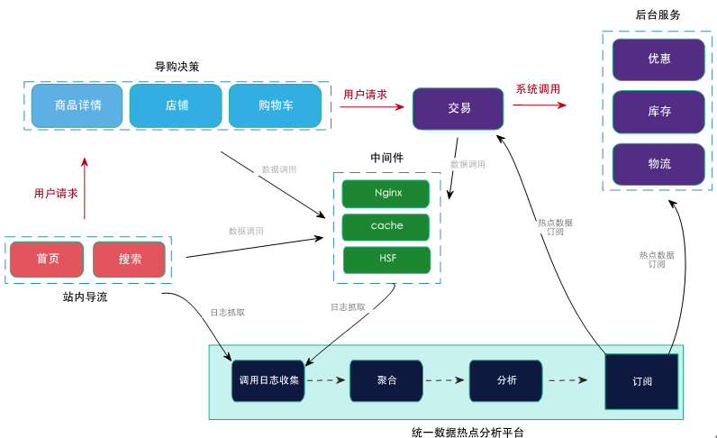

## 思维导图

## 举栗子
### 案例
电商场景中，我们平常购物都是这样，看到喜欢的商品然后下单，然后支付完成订单，但并不是每个下单请求你都最后付款了。
### 问题：系统何时减库存
- 用户下单时扣减？
- 用户支付完成时扣减？

### 常见扣减方式
下单减库存
用户下单后，在商品sku库存中减去用户购买的数量
特征
方式简单，控制最精确，通过数据库事务机制控制商品库存，不会出现超卖
问题
正常情况下，用户下单后一般会很大概率付款，不会有大问题。有特殊场景：黄牛 or 竞争对手（统一代指竞争对手） 竞争对手通过恶意下单，将商家商品全部下单，让商品库存为0，就不能正常售卖，就会导致商品不能正常售卖，竞争对手没有一点下单成本。
支付减库存
用户下单后，并不立即扣减，而是用户完成支付后，才真正扣减库存，否则库存一直留给真正付款的用户
特点
避免类似黄牛 or 竞争对手的恶意下单
问题
并发高的情况下，用户下单后可能会出现付不了款（超卖问题）
超卖解决办法
商家允许的情况下，通过补货来解决
商家不允许的情况下，提示库存不足，不能完成支付
预扣库存（典型的预扣库存方案）
用户下单后，库存保留一定的时间（比如预售：30分钟），超过时间未付款，库存自动释放，留给其他用户继续购买
流程
下单时，预减库存，检测库存是否有充足
充足，扣减库存
不足，下单失败，提醒用户
支付完成时，校验订单有效性
订单未过期，支付成功
订单过期，其实库存已经释放，给用户退款
问题
虽然设置了库存的保留时间，但是用户可以在释放库存后再次枪口，或者一次抢购大量库存抢占
解决办法
结合风控和反作弊的措施来制止，例如：控制购买数量（预售一次只能一个）、未付款的情况下不能再次下单等等
大型秒杀场景
一般秒杀情况下，商品都是爆款（可以理解为"抢到就是赚到"），下单后不付款情况很少，同时商家对于库存有严格的限制，"下单减库存"更加合理，同时该方式对比其他两种场景来说，逻辑上更加简单，性能上占有优势。
如何保障一致性？
根本目的就是保证数据库中库存字段对应的数值不能小于零！
常见解决方案
系统中通过事务来判断，保证扣减后数据不为负数，否则回滚
设置数据库字段数据为无符号证书，通过扣减是，字段值小于零触发sql语句报错
使用where 语句

使用case when 语句

注意：在Case函数中Else部分的默认值是NULL，这点是需要注意的地方
极致优化方案
思路：库存扣减环节中，主要解决的问题是"并发写"，写在哪里？缓存 or 数据库~
缓存中扣减库存
适合没有复杂的SKU库存和总库存这种联动关系。如果存在复杂的减库存逻辑，或者使用事务，还是必须在数据库中扣减
数据库中扣减
特性
基于Mysql数据存储的特性，同一个sku的库存扣减肯定是在同一行，会有大量的线程竞争InnoDB行锁，并发越高，等待线程就越多，TPS（Transaction Per Second，每秒处理的事务数量）会下降，系统的整体RT（响应时间）就会跟着上升，严重影响到数据库的吞吐量
问题
常见的电商场景中，单个热点商品会影响整个数据库的性能，导致0.01%的商品影响99.99%商品的售卖。
解决办法
热点隔离
热点商品隔离到热点数据库中，但也带来问题，热点数据动态迁移和单独数据库维护等等问题，而且没有彻底解决并发锁的问题！！！

应用层排队
按照商品纬度设置队列排队，减少同一台机器对数据库同一行进行操作的并发度，同时也控制单个商品占用数据库连接的数量，防止热点商品占用太多的数据库连接
数据库层排队（修改MySql源代码）
机器数过多的情况下，应用层只是做到了单机排队，控制的并发能力有限。阿里数据库团队开发了针对Mysql的InnoDB层上的补丁程序（patch），可以在数据库层面对单行记录做到并发排队。
其他
InnoDB内部存在死锁检测，MySql server 和 InnoDB的切换也会比较消耗性能，阿里数据库团队做了很多该方面的优化。COMMIT_ON_SUCCESS 和 ROLLBACK_ON_FAIL的补丁程序，配合在SQL里面添加hint（https://blog.csdn.net/fromdw/article/details/6653882），在事务里不需要等待应用层提交（COMMIT），而在数据库执行完最后一条SQL后，直接根据TRAGET_AFFECT_ROW的结果进行提交或回滚，可以减少网络等待时间（平均约0.7ms）。
该种方式，TPS在高并发下，从原始的150飙升到8.5w，提升近566倍！最新数据未知~
貌似AliSQL开源了相关的补丁程序（待查证）
淘宝的解决方案
背景
在秒杀/热卖商品的时候，会发生并发线程增加，tps急剧下降，于此同时每个商品有128个线程并发请求的时候，tps已经跌到600 不可接受的数值，在这个时候，还有更坏消息是，秒杀的时候，一个商品何止128个人来抢?
解决方案
I： 关闭死锁检测，提高并发处理性能
对于秒杀/热卖商品这种情况，通过认真的分析，可以得出这种情况的特点，首先是很直接，其次是很暴力，正常的业务死锁会变成超时，最后是不治标，除掉老大，还有老二，问题的症结没有解决，这时候究竟该如何解决呢?经过不断努力，得出了第一种解决方法关掉死锁检测。
II：修改源代码，将排队提到进入引擎层前，降低引擎层面的并发度。
如果请求一股脑的涌入数据库，势必会由于争抢资源造成性能下降，通过排队，让请求从混沌到有序，从而避免数据库在协调大量请求时过载。
对于在固定的硬件条件下、每个系统都有一个对应的状态最优值，那么在InnoDB的线程数下，将排队队列提到进入引擎层前，这样就能够很好的解决在性能方面具有很好的提高。

III：组提交，降低server和引擎的交互次数，降低IO消耗（很多细节问题，后续研究探讨）
请求合并：甲买了一个商品，乙也买了同一个商品，与其把甲乙当做当做单独的请求分别执行一次商品库存减一的操作，不如把他们合并后统一执行一次商品库存减二的操作，请求合并的越多，效率提升的就越大。
根据前面的排队技术，利用多线程并发下，InnoDB内部要做死锁检测等操作，会对性能影响及其严重，明确的串行事务，则server层串行，Group commit减少引擎执行次数，让性能最佳优。
题外话
Redis只是解决性能问题，数据库才是解决库存一致性问题
没有万能的系统，任何算法和架构都顶不住巨大的流量，限流是万精油！
预扣的库存超时后如何进行库存回补？
第三方支付完成时，如何保证扣减库存和成功付款时的状态一致性？