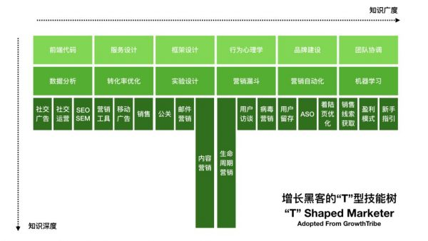
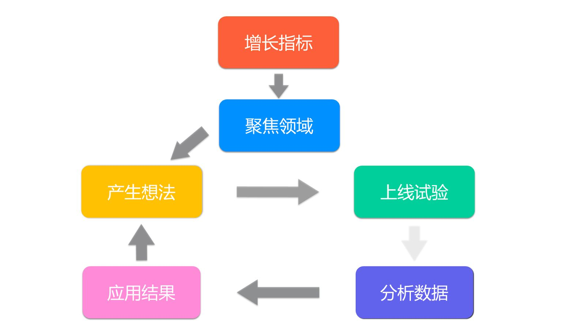

# 第一章 首席增长官的崛起
## 什么是首席增长官
- 可口可乐设立首席增长官
- 越来越受欢迎的首席增长官
> - 71%首次任命，86%从2014开始任命
> - 搜索岗位从2013年开始的3年内，需求增加10倍，从1000到1w
- 概括
> 以不断变化的顾客需求为核心，将市场、产品、运营和客户服务通过一体化战略的方式来推动公司增长的核心管理职位
- LinkedIn定义
> - 新型的管理岗位
> - 职责是连接各个部门并且打破个传统部门（例如销售、市场、运营以及IT等）之间的藩篱，从整体上关注客户需求、市场动态以及卖家的行为和喜好
> - 在整个流程上提供最佳的用户体验，从而令整个公司聚焦高速增长
> - 领导者，重塑企业内部的组织结构，令企业能够持续地利用各种先进的技术，与潜在买家在购买周期内进行互动
## 为什么会出现首席增长官
- 市场：红利消退、增长放缓、竞争加速
> - 人口红利开始消退
> > - 刘易斯拐点
> - 流量红利不退萎缩
> > - 互联网用户数增长速度下降
> - 资本红利萎缩
> > - 马太效应：弱者越弱，强者越强
> > - 移动终端头部用户（前20个APP）占据了71%的用户时间
> > - 2016年下半年以来，一、二级市场那投资难度加大，门槛增加，投资人越来越谨慎
> - 综述：纵观“互联网上半场”，流量、风口等词汇充满我们的视野；接下来的“互联网下半场”，产品价值、用户体验将成为新的主题
- 客户：从被动接受信息到主动选择产品
> - 早期，通过广告和媒体渠道推广公司，产品和服务，企业站在消费者的对立面，通过对信息绝对控制的沟通方式来达到商业目的，可以称之为从商家到客户的一种完全单项的交流或者广播
> - 互联网和科技的发展，信息越来越对称，客户已经有了更多的自主权（在购买或者被称为“转化漏斗”的过程中有了更多的自主权），在接触商家之前已经做了很多的研究，了解要购买产品的优势和劣势。
> - 互联网催生的大量免费的数字化信息正在迅速地重塑各产业，重塑企业解除潜在客户的方法。
> - “增长性”的思维，一种以客户为中心展开的思维，这种思维会直接导致业务增长发生本质性的变化
- 技术：为用户生命周期提供数据洞察力
> - 技术创新变革
> > - 1785年第一次浪潮：铁、水力、机械化、纺织行业、贸易
> > - 1845年第二次浪潮：蒸汽动力、铁路、钢铁、棉布
> > - 1900年第三次浪潮：店里、化学制品、内燃机
> > - 1950年第四次浪潮：石油化工、电子产品、航天航空
> > - 1990年第五次浪潮：数字化网、生物产业、软件信息技术
> > - 2020年第六次浪潮：可持续发展、一体化设计、仿生学、卢瑟化学、工业生态、可再生能源、纳米技术
> - 以技术驱动的增长，就是对客户（或者买家）的数据洞察进行精确把握，进而优化业务增长和盈利能力
- 管理：从职能型组织向增长型组织进化
> - 传统的商业流程
> > - 品牌认知（口碑）：市场部门
> > - 市场运营（获取）：市场部门
> > - 产品交互（体验）：产品部门
> > - 营收变现（转化）：销售部门
> > - 客户忠诚（留存）：客服部门
> - 以品牌和客户认知度为中心的、传统的市场营销思维亟需进化，企业业务增长的驱动力必须懂市场营销拓展到业务的各个流程
## 首席增长官是做什么的
- 首席增长官的定位
> - 企业增长的领导者和负责人，直接向首席执行官或者公司总裁汇报工作
- 首席增长官的角色
> - 可信赖的顾问和企业文化的挑战者
> - 具有丰富品牌建设和财务管理经验的管理者
> - 应对外部市场需求变动的内部协调者
- 首席增长官的职责
> - 建立以客户为中心的高效业务增长体系
> - 简历增长团队，打破部门间的隔阂，优化内部资源
> - 管理公司的新产品策略以及研发，特别是产品创新以及相关投资并购
- 案例：LinkedIn增长的秘密武器
> - 六年间40倍增长
> - 首席增长官的力量
> - 增长是对商业本质的洞察
> - LinkedIn的增长策略
> - 用数据驱动用户增长
> - 公司自上而下对数据驱动文化的认同

# 第二章 从增长黑客到首席增长官
- 首席增长官进阶的三个阶段
> - 首席增长官进阶阶段
> > - 增长黑客（特种兵）
> > - 增长团队（特种作战分队）
> > - 首席增长官（总指挥）
> - 企业增长周期阶段
> > - 阶段一：问题和解决方案匹配期，主要是调研客户的需求
> > - 阶段二：最小可行性产品时期，需求若干种最小可行性产品的建立方法
> > - 阶段三：产品和市场匹配时期，提升用户的粘度和体验
> > - 阶段四：渠道和产品匹配时期，对高优先级的渠道进行大规模的投入
> > - 阶段五：成熟期，并购、国际化和本地化
> > - 增长黑客：1~2，增长团队：1~4，首席增长官：1~5
- 增长黑客
> - 增长黑客概念的提出
> > - Sean Ellis
> > > 将增长作为唯一目标的人，做的所有事情都是围绕如何扩大增长而开展
> > - Andrew Chen
> > > 市场营销人员和工程技术人员的混血儿，着眼于“产品该如何获取用户”等传统问题，并通过A/B测试、落地页、病毒营销、邮件营销等方式来解决
> - 增长黑客的能力模型
> > - 市场营销、产品研发、数据分析三个角色的聚合。增长黑客的核心，用最快的方法、最低的成本、最高的手段获取大量的增长

- 增长团队
> - 增长团队的组织架构
> > - Facebook：独立性增长团队
> > - LinkedIn：功能矩阵型增长团队
> > - Pinterest：功能分布性增长团队
> - 增长团队的组件和分工
> > - 组件增长团队的条件
> > > - 产品：是否通过核心价值测试？（产品和市场匹配，Product/Market Fit，PMF）
> > > - 文化：是否得到高级管理层的理解和支持？
> > > - 资源：能够拿到资源和工具？
> > > - 流程：是否设计好增长团队的工作流程和增长思路？
> > > - 人员：能否从内部组件一个跨部门的团队，如何架构这个团队？
> > > - 突破点：是否想好最初90天的聚焦领域
> > - 增长团队的人员分工
> > > - （增长）产品经理：负责产品内激活、留存和传播机制的开发和改进
> > > - （增长）营销经理：通过搜索引擎、社交、邮件等各种可量化渠道获取和留存用户
> > > - 工程师、设计师、产品、营销经理：通过紧密合作来设计和上线各种试验
> > > - 数据分析师：提供各种用户行为数据，分析试验结果，为增长寻找灵感
> > > - 增长团队负责人：最终对用户增长的指标负责
> > - 增长团队的工作流程
> > > - 从增长指标开始找到最小的聚焦了领域，产生想法、上线试验、分析数据、应用结果，这个几个不断循环，知道你关注的指标有一定改善

- 首席增长官
> - 问题和解决方案匹配时期
> > - 关注并发现客户的痛点，进而探索解决方案
> - 最小可行性产品时期
> > - 用最小的产品去试验产品的需求，并且持续收集用户的行为数据作为下一阶段产品迭代的反馈（用最少的时间和资源开发出一个MVP(Minimum Viable Product，最小可行性产品)）
> - 产品和市场匹配时期
> > - 一个问题：如果你现在不能继续使用这产品了，你会有怎样的感受？
> > > - 失望的用户是否超过40%，来判定产品对否达到了PMF状态
> - 渠道和产品匹配时期
> > - 利用科技来大幅度优化长尾渠道的营销效率
> > - 带领团队不断用新的技术去探测并且测试分析各个渠道的效率
> - 成熟期
> > - 仍需对增长团队进行各种投入，通过不断测试来发展并扩大客户的购买力和未曾覆盖新用户的渠道（常见的方法：并购）
> - 不但要关注产品，还应该关注客户服务与支持，同时做到非常有效的营销，做到用数据和技术驱动，要有战略和并购的意识

# 第三章增长框架
- 增长框架的概述
> - 学习引擎模型
> > - 计划
> > > 清楚地阐明业务问题、目标、潜在资源、项目范围，以及高层项目时间表
> > - 投入
> > > 团队确认增长渠道，进行资源的调配和制定短期目标
> > - 衡量
> > > 衡量什么以及如何衡量，投入精力来评估所提出的衡量系统的适用性
> > - 分析
> > > 识别、验证并作出和立刻执行的推荐方案
> > - 优化
> > > 根据以上步骤获取的信息来不断找出进一步提高团队效率和业务指标的过程
> - 用户增长模型（AARRR模型）
> > - 获取用户
> > > 用户从哪些渠道来，如何成为我们产品的使用者
> > - 激活用户
> > > 新用户是否感受到我们提供的产品价值，如何帮助其快速提上手体验
> > - 用户留存
> > > 用户为什么会留下来，如何让用户反复购买或者使用我们的产品与服务
> > - 用户营收
> > > 我们的产品能否将留下来的用户变现
> > - 用户推荐
> > > 用户是否对产品满意，会不会把我们的产品推荐给他的朋友们
- 正确的增长目标：北极星指标
> - 北极星指标的重要性
> > - 做增长涉及公司运营的方方面面，没有一个明确的指标指引，很容易眉毛胡子一把抓，无法有效的集中火力抓住重点
> > - 当公司达到一定规模时，一个共同的目标可以吧团队调整到同一个方向上，并且明确任务的优先级
> > - 设定一个指标，能够大幅提高执行力
> - 关于北极星指标的两个案例
> > - 美剧《硅谷》中的Pied Piper
> > > - 安装量和DAU（日活）
> > - Facebook如何突破MySpace的重围
> > > - 用户数和月活跃用户数
> - 制定北极星指标的6个标准
> > - 产品的核心价值是什么？这个指标可以让你知道你的用户体验实现了这种价值吗
> > - 这个指标能够反映用户的活跃程度吗
> > - 如果这个指标变好了，是不是能说明你的公司是在向好的方向发展
> > - 这个指标是不是很容易被你的整个团队理解和交流呢
> > - 这个指标是一个先导指标，还是一个滞后指标
> > - 这个指标是不是一个可操作的指标
> - 指标典型案例
> > - 案例、商业模式、核心价值、北极星指标
> > - airbnb、市场、链接租房者和房东、订天数
> > - 亚马逊、电商、便捷的网上购物、总销售额
> > - 知乎、社区、知识传播、问题回答数
- 高效的衡量技术：数据采集
> - 什么是用户行为数据
> > - 用户行为数据的定义
> > > - 在产品内进行各种操作产生的数据
> > > - 用户行为：访问、浏览、行为事件
> > > - 构成元素：事件、地点、任务、交互、交互的内容
> > - 用户行为数据的意义
> > > - 衡量市场营销效果
> > > - 激活转化效果分析
> > > - 用户留存/活跃分析
> > > - 产品营收变现分析
> - 埋点采集数据（Capture（捕获）模式）
> > - 七个步骤
> > > - 确定场景或目标
> > > - 数据采集规划
> > > - 埋点采集数据
> > > - 数据评估和数据分析
> > > - 给出优化方案
> > > - 实施优化方案
> > > - 持续监测评估
> > - 四个缺点
> > > - 依赖经验导向
> > > - 沟通成本高
> > > - 大量时间数据清洗
> > > - 数据漏采错采
> - 无埋点采集技术（Record（记录）模式）
> > - 采集原理
> > > - 用机器来代替人的经验：比如GrowingIO中，在第一次使用时加载一段SDK代码，即可采集全量、实时的用户行为数据
> > > - 原子数据纬度：WHO、WHEN、WHERE、WHAT、HOW
> > - 技术优势
> > > - 解决了埋点采集的2、3、4步骤的需求，将原来的多方参与减少到基本就一方了。
> > > - 极大地简化分析流程，提高效率，直达业务
> - 一站式数据采集解决方案
> > - “埋点+无埋点”的数据采集原理
> > > - 无埋点SDK会自动采集用户在这个APP上的所有行为数据，包括访问、页面浏览和行为数据
> > > - 无埋点方案可以采集更多的交易数据，包括商品SKU、价格、折扣、支付等信息
> > - “埋点+无埋点”的数据采集优势
> > > - 无埋点的方法本身效率比较高
> > > - 无埋点数据采集成本低，APP发版/网站上线，都不影响数据自动采集
> > > - 埋点采集的优势是可以更加详细的描述每个事件的属性，特别是正对结果型数据
- 科学的学习方法：数据分析
> - 数据分析的战略思维
> > - 数据分析的目标
> > > 利用大数据为所有职场人员做出迅捷、高质、高效的决策，提供可规模化的解决方案
> > - 数据分析的作用
> > > 反推客户的需求，创造更多符合需求的增值产品和放入无，重新投入哟洪湖的使用，从而形成一个完整的业务闭环
> > - 数据分析进化论
> > > - 观察数据当前发生了什么
> > > - 理解为什么发生
> > > - 预测未来会发生什么
> > > - 商业决策
> > - 数据分析的EOI（助理-优化-创新）框架
> > > - 三类业务项目：核心任务、战略任务、风险任务
> > > - 核心任务：数据分析是助力（E），帮助公司更好的盈利，提高盈利效率
> > > - 战略任务：数据分析是优化（O），如何能够辅助战略性任务找到方向和盈利点
> > > - 风险任务：数据分析是共同创新（I），努力验证创新项目的重要性
> - 数据分析的三大思路
> > - 数据分析的基本步骤
> > > - 挖掘业务含义：理解数据分析的背景、前提以及想要关联的业务场景结果是什么
> > > - 制定分析计划：如何对场景拆分，如何推断
> > > - 拆分查询数据：拆分出需要的数据，真正落地分析本身
> > > - 提炼业务洞察：从数据结果中，判断提炼出上午洞察
> > > - 产出商业决策：根据数据结果洞察，最终产出商业决策
> > - 内外因素分解法
> > > - 内部和外部因素、可控和不可控
> > > > - 内部可控因素：产品近期上线更新、市场投放渠道变化、产品粘性、新老用户留存问题、核心目标的转化
> > > > - 外部可控因素：市场竞争对手近期行为、用户使用习惯的变化、招聘需求随时间的变化
> > > > - 内部不可控因素：产品策略（移动端/PC端）、公司整体战略、公司客户群定位
> > > > - 外部不可控因素：互联网招聘行业趋势、整体经济形势、季节性变化
> > - DOSS思路
> > > 从一个具体问题拆分到整体影响，从单一的解决方案到找到一个规模化解决方案的方式
> > - 四个步骤
> > > - 具体问题
> > > - 整体影响
> > > - 单一回答
> > > - 规模化方案
> - 数据分析的八种方法
> > - 数字和趋势
> > - 维度分析
> > - 用户分群
> > - 转化漏斗
> > > - 从开始到结尾，整体的转化率是多少
> > > - 每一步的转化率是多少
> > > - 哪一步流失最多，原因是什么？流失的用户符合哪些特征？
> > - 行为轨迹
> > - 留存分析
> > - A/B测试
> > > - 必备因素
有足够的时间进行测试
数据量和数据密度较高
> > - 数学建模

# 第四章 用户增长模型